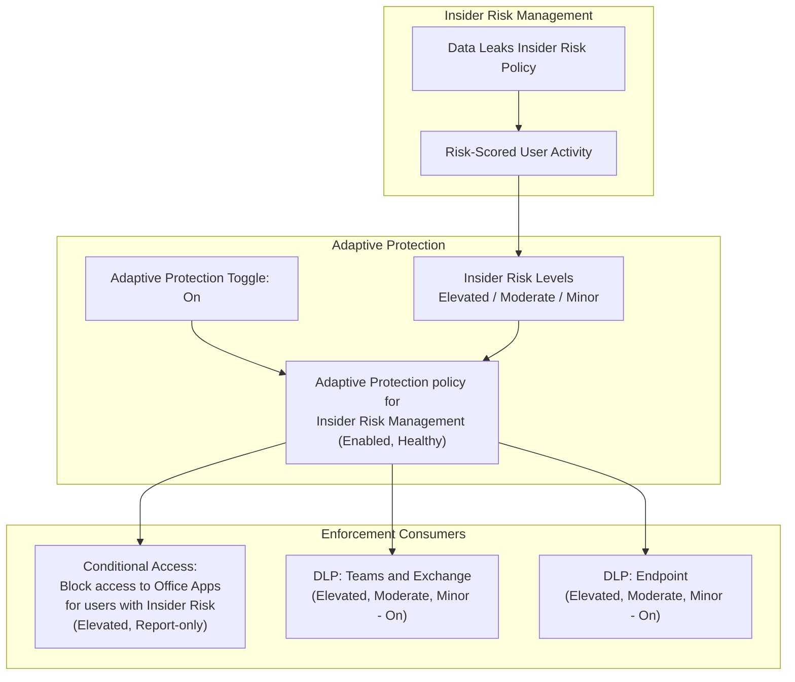
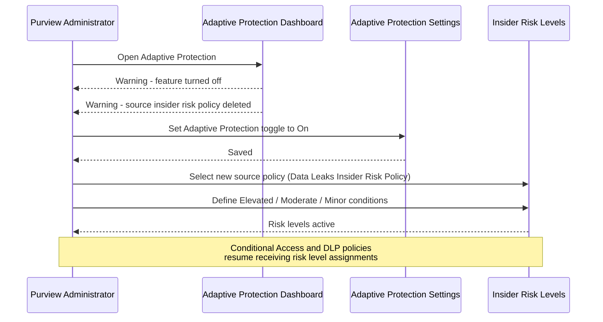

# Architecture — Microsoft Purview Adaptive Protection

## Purpose

Describe the logical architecture connecting Insider Risk Management, Adaptive Protection, and its two enforcement consumers (Conditional Access and Data Loss Prevention), as observed in this lab.

## Component Model

| Component | Role | Evidence |
|---|---|---|
| **Data Leaks Insider Risk Policy** | Source Insider Risk Management policy; computes user activity risk scores | `images/5`, `images/7` |
| **Insider risk levels (Elevated / Moderate / Minor)** | Threshold definitions mapping risk-scored activity to a discrete risk level per user | `images/5` |
| **Adaptive Protection (toggle + settings)** | Tenant-level feature that assigns computed risk levels to users and shares them with DLP/Conditional Access | `images/2` |
| **Adaptive Protection policy for Insider Risk Management** | System-generated backend policy object enforcing the Adaptive Protection feature | `images/6` |
| **Conditional Access policy** | Consumes "Insider risk" condition; currently Report-only, scoped to Elevated risk | `images/3` |
| **DLP policies (Teams/Exchange, Endpoint)** | Consume "Insider risk level for Adaptive Protection is" condition; actively enforcing (On) | `images/4` |

## High-Level Architecture Diagram

## Failure and Recovery Flow (as observed in this lab)

## Configuration Verification

Only the following were directly observed in this lab and are treated as verified fact:

- Adaptive Protection was off with a deleted source policy at the start of this lab (Step 1).
- Adaptive Protection was turned On (Step 2).
- `Data Leaks Insider Risk Policy` is the selected source policy, with Elevated/Moderate/Minor conditions defined (Step 5).
- One Conditional Access policy (Report-only, Elevated) and two DLP policies (On, Elevated/Moderate/Minor) consume Adaptive Protection risk levels (Steps 3–4).
- The backend Adaptive Protection policy is Enabled and Healthy, and all three dependent Insider Risk Management policies are Enabled (Steps 6–7).

## Security Notes

- Adaptive Protection is a **risk-adaptive control layer**, not a standalone detection engine — its entire output depends on the accuracy and health of the source Insider Risk Management policy.
- The Conditional Access policy's Report-only status means Elevated-risk users are not yet actually blocked from Office Apps; this is a staged-rollout safety measure but should be tracked as an open item toward full enforcement.
- DLP policies in this lab are already fully enforcing (On) across a broader set of risk levels (Elevated, Moderate, Minor) than the Conditional Access policy (Elevated only) — this asymmetry should be a deliberate, documented decision rather than an oversight.
