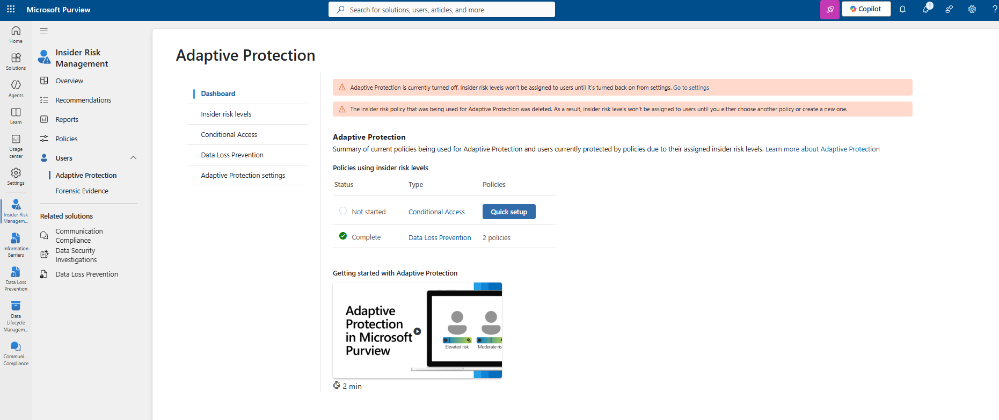
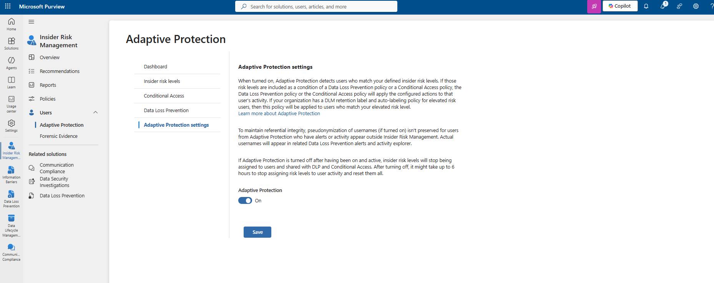

# Implementation Guide — Microsoft Purview Adaptive Protection

This guide documents every screenshot in [`images/`](images/) in sequence. Each step lists the exact portal location, the image, and an explanation limited strictly to what is visible.

---

## Step 1: Review the Adaptive Protection Dashboard



**Location:** Microsoft Purview portal → Insider Risk Management → Users → Adaptive Protection → Dashboard

**Explanation**

The Adaptive Protection dashboard is the starting point of this lab and reflects an unhealthy initial state. Two warning banners are displayed:

- *"Adaptive Protection is currently turned off. Insider risk levels won't be assigned to users until it's turned back on from settings. Go to settings."*
- *"The insider risk policy that was being used for Adaptive Protection was deleted. As a result, insider risk levels won't be assigned to users until you either choose another policy or create a new one."*

The **Policies using insider risk levels** table shows two rows:

| Status | Type | Policies |
|---|---|---|
| Not started | Conditional Access | Quick setup |
| Complete | Data Loss Prevention | 2 policies |

A **Getting started with Adaptive Protection** panel links to a 2-minute overview video.

> **Note**
> This dashboard confirms Adaptive Protection has two independent failure conditions at the start of this lab: the feature toggle itself is off, and its source insider risk policy no longer exists. Both must be resolved (Steps 2 and 5) before Adaptive Protection can function.

---

## Step 2: Enable Adaptive Protection in Settings



**Location:** Insider Risk Management → Users → Adaptive Protection → Adaptive Protection settings

**Explanation**

The **Adaptive Protection settings** page explains the feature's behavior:

- When turned on, Adaptive Protection detects users who match defined insider risk levels. If those risk levels are included as a condition of a DLP policy or a Conditional Access policy, that policy applies its configured actions to the matched user's activity.
- If the organization has a Data Lifecycle Management (DLM) retention label and auto-labeling policy for elevated risk users, that policy is applied to users who match the elevated risk level.
- To maintain referential integrity, username pseudonymization (if turned on elsewhere) is **not** preserved for Adaptive Protection users whose alerts or activity appear outside Insider Risk Management — actual usernames appear in related DLP alerts and Activity Explorer.
- If Adaptive Protection is turned off after being active, insider risk levels stop being assigned and shared with DLP and Conditional Access. This can take **up to 6 hours** to fully stop assigning risk levels and reset them.

The **Adaptive Protection** toggle is set to **On**, with a **Save** button beneath it.

> **Tip**
> Because disabling Adaptive Protection can take up to 6 hours to fully propagate, plan any toggle change (on or off) outside of an active incident response window.

---

## Step 3: Review Conditional Access Policies Using Insider Risk


**Location:** Insider Risk Management → Users → Adaptive Protection → Conditional Access

**Explanation**

This page lists Conditional Access policies that include the condition **"Insider risk."** One policy is present:

| Policy Name | Policy State | Insider Risk Levels | Policy Status | Last Modified |
|---|---|---|---|---|
| Block access to Office Apps for users with Insider Risk (Preview) | Active | Elevated | Report-only | 6 minutes ago |

**Create policy** and **Refresh** actions are available above the list.

> **Note**
> The policy status is **Report-only**, meaning Conditional Access is currently logging what *would* happen for Elevated-risk users attempting to access Office Apps, without actually blocking access. This is consistent with a safe, staged rollout approach.

---

## Step 4: Review Data Loss Prevention Policies Using Insider Risk


**Location:** Insider Risk Management → Users → Adaptive Protection → Data Loss Prevention

**Explanation**

This page lists DLP policies that include the condition **"Insider risk level for Adaptive Protection is."** Two policies are present:

| Policy Name | Policy State | Policy Location | Insider Risk Levels | Policy Status |
|---|---|---|---|---|
| Adaptive Protection policy for Teams and Exchange DLP | Active | Exchange, Teams | Elevated, Moderate, Minor | On |
| Adaptive Protection policy for Endpoint DLP | Active | Devices | Elevated, Moderate, Minor | On |

Both policies were last modified approximately 2 days prior to capture and are actively enforcing (**Policy status: On**), unlike the Conditional Access policy in Step 3, which remains in Report-only mode.

> **Note**
> Both DLP policies reference all three insider risk levels (Elevated, Moderate, Minor), while the Conditional Access policy in Step 3 references only the Elevated level. This means DLP enforcement in this lab has broader risk-level coverage than Conditional Access enforcement.

---

## Step 5: Configure Insider Risk Levels


**Location:** Insider Risk Management → Users → Adaptive Protection → Insider risk levels

**Explanation**

This page defines how risky a user's activity is, based on criteria such as the number of exfiltration activities performed or whether their activity generated a high-severity insider risk alert.

**Insider risk policy:** `Data Leaks Insider Risk Policy` is selected as the source policy — this is the replacement policy that resolves the "deleted policy" warning observed in Step 1.

**Conditions for insider risk levels:**

| Risk Level | Condition |
|---|---|
| Elevated risk level | User performs at least 3 sequences, each with a high severity risk score (67 to 100) |
| Moderate risk level | User performs at least 2 data exfiltration activities, each with a high severity risk score (67 to 100) |
| Minor risk level | User performs at least 1 data exfiltration activity with a high severity risk score (67 to 100) |

**Additional settings:**

| Setting | Value |
|---|---|
| Past activity detection | 7 days of previous activity |
| Insider risk level timeframe | 7 days (maximum allowed: 30 days) |
| Insider risk level expiration | Checked — "Expire the risk level when a user's alert is dismissed or case is closed" |

> **Note**
> Each risk level threshold is defined by risk **score** (67–100, i.e., high severity) combined with an **activity count** — the tiers escalate from 1 exfiltration activity (Minor) to 2 (Moderate) to 3 full sequences (Elevated), rather than simply a higher score threshold. Sequences (as configured in the underlying Data Leaks Insider Risk Policy) represent multi-step activity chains, so the Elevated tier requires evidence of coordinated, multi-step behavior rather than isolated events.

---

## Step 6: Verify the Adaptive Protection Policy Using PowerShell


**Location:** Security & Compliance PowerShell (Exchange Online Management module)

**Purpose**

Confirm the system-generated Adaptive Protection policy exists, is enabled, and reports a healthy status directly from the backend, independent of the portal UI.

**Command**

```powershell
Get-InsiderRiskPolicy | Where-Object {$_.Name -like "*Adaptive*"} | fl Name,Enabled,PolicyHealth
```

**Expected Output**

```
Name        : Adaptive Protection policy for Insider Risk Management
Enabled     : True
PolicyHealth : {"HealthStatus":"Healthy","UnhealthyCount":0,"RecommendReviewCount":0,"ValidationDetails":[]}
```

**Explanation**

- `Name` confirms the system-generated policy `Adaptive Protection policy for Insider Risk Management` — this is distinct from the source `Data Leaks Insider Risk Policy` selected in Step 5.
- `Enabled: True` confirms the policy is active at the backend level, consistent with the **On** toggle set in Step 2.
- `PolicyHealth` returns a JSON object: `HealthStatus: Healthy`, `UnhealthyCount: 0`, `RecommendReviewCount: 0`, and an empty `ValidationDetails` array — indicating no configuration problems requiring review.

**Verification**

A `HealthStatus` of `Healthy` with zero `UnhealthyCount` and zero `RecommendReviewCount` is the expected, correctly-configured state.

**Troubleshooting**

If `Enabled` returns `False`, Adaptive Protection was not successfully turned on in Step 2, or has not yet propagated. If `HealthStatus` is not `Healthy`, review `ValidationDetails` for the specific configuration issue.

---

## Step 7: Verify All Insider Risk Management Policies Using PowerShell


**Location:** Security & Compliance PowerShell (Exchange Online Management module)

**Purpose**

Enumerate every Insider Risk Management policy in the tenant and confirm the mode and enabled status of each, providing full visibility beyond the single Adaptive Protection policy queried in Step 6.

**Command**

```powershell
Get-InsiderRiskPolicy | fl Name,Mode,State,Enabled
```

**Expected Output**

```
Name    : Adaptive Protection policy for Insider Risk Management
Mode    : Enable
Enabled : True

Name    : IRM_Tenant_Setting_27b3f7d4-7532-48fe-a4ec-33d105b2b136
Mode    : Enable
Enabled : True

Name    : Data Leaks Insider Risk Policy
Mode    : Enable
Enabled : True
```

**Explanation**

Three policies are returned:

| Name | Mode | Enabled | Purpose |
|---|---|---|---|
| Adaptive Protection policy for Insider Risk Management | Enable | True | System-generated Adaptive Protection enforcement policy (same policy verified in Step 6) |
| IRM_Tenant_Setting_27b3f7d4-7532-48fe-a4ec-33d105b2b136 | Enable | True | System-generated tenant-level Insider Risk Management settings object, not a user-authored policy |
| Data Leaks Insider Risk Policy | Enable | True | The source Insider Risk Management policy referenced in Adaptive Protection settings (Step 5) |

> **Note**
> The `State` property was included in the command but does not appear in the captured output for any of the three policies. In PowerShell, `Format-List` (`fl`) omits properties that are null or empty by default for a given object; this indicates the `State` property returned no value for these policies at the time of capture, rather than being manually excluded from the query.

**Verification**

All three policies returning `Mode: Enable` and `Enabled: True` confirms the entire policy chain that Adaptive Protection depends on — the tenant setting, the source insider risk policy, and the Adaptive Protection enforcement policy itself — is active.

**Troubleshooting**

If `Data Leaks Insider Risk Policy` (or its equivalent source policy) is missing from this output entirely, this reproduces the exact failure condition observed in Step 1 (deleted source policy) and Adaptive Protection will not assign risk levels until a valid source policy is selected again in Step 5.
