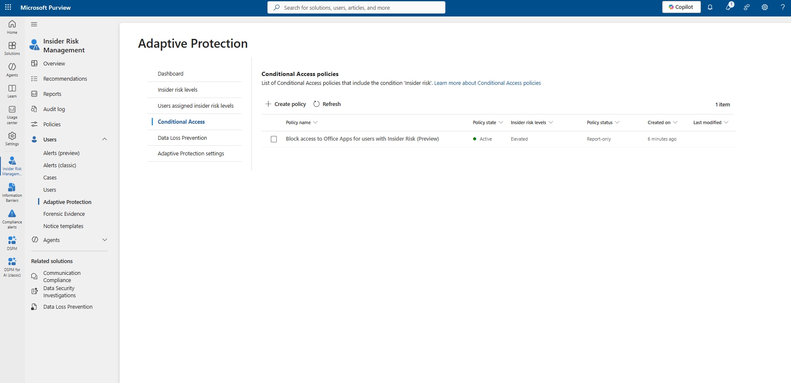
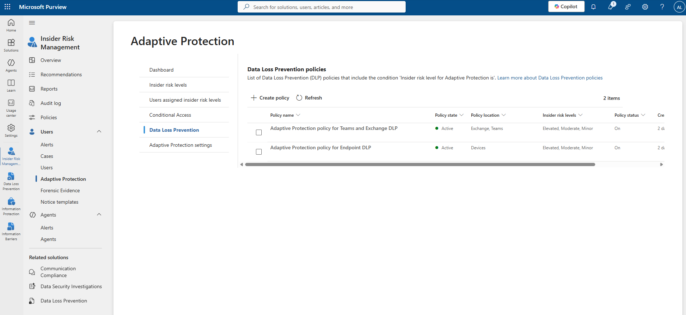
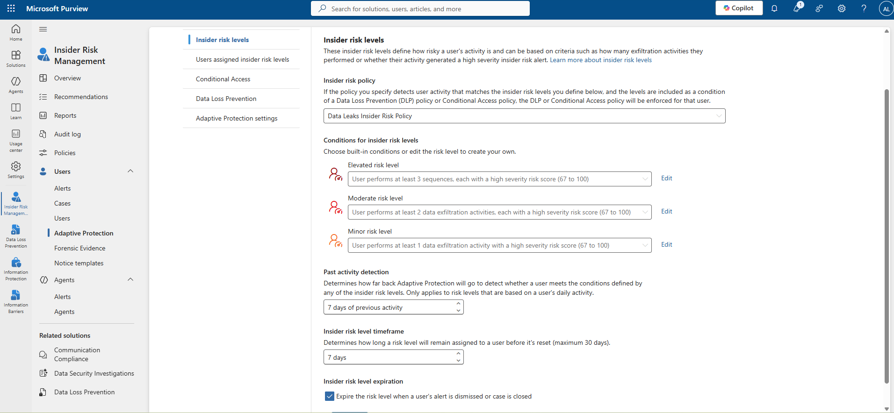
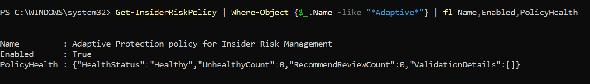
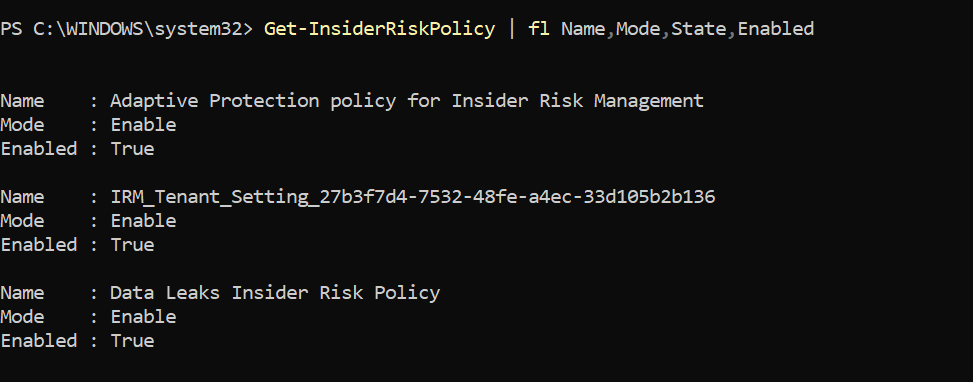

# Verification — Microsoft Purview Adaptive Protection

This document verifies the Adaptive Protection deployment at two layers: the Microsoft Purview portal (policy consumers) and PowerShell (policy configuration and health). All evidence is sourced from [`images/`](images/).

---

## Layer 1: Portal Verification

### Conditional Access Policy Verification



| Check | Expected | Observed | Result |
|---|---|---|---|
| At least one Conditional Access policy references "Insider risk" | Yes | `Block access to Office Apps for users with Insider Risk (Preview)` | Pass |
| Policy state | Active | Active | Pass |
| Insider risk level referenced | Defined level(s) | Elevated | Pass |
| Policy status | Report-only or On | Report-only | Pass (staged rollout confirmed) |

### DLP Policy Verification



| Check | Expected | Observed | Result |
|---|---|---|---|
| DLP policies reference "Insider risk level for Adaptive Protection is" | 1 or more | 2 policies | Pass |
| Policy state | Active | Active (both) | Pass |
| Policy status | On | On (both) | Pass |
| Insider risk levels referenced | Defined level(s) | Elevated, Moderate, Minor (both policies) | Pass |

### Insider Risk Level Configuration Verification



| Check | Expected | Observed | Result |
|---|---|---|---|
| Source insider risk policy selected | A valid, existing policy | `Data Leaks Insider Risk Policy` | Pass |
| Elevated risk level condition defined | Yes | At least 3 sequences, high severity (67–100) | Pass |
| Moderate risk level condition defined | Yes | At least 2 exfiltration activities, high severity (67–100) | Pass |
| Minor risk level condition defined | Yes | At least 1 exfiltration activity, high severity (67–100) | Pass |
| Past activity detection window | Defined | 7 days | Pass |
| Insider risk level timeframe | Defined (max 30 days) | 7 days | Pass |

---

## Layer 2: PowerShell Verification

### Verification 1 — Adaptive Protection Policy Health



**Purpose**

Confirm the system-generated Adaptive Protection policy is enabled and reports a healthy configuration state.

**Command**

```powershell
Get-InsiderRiskPolicy | Where-Object {$_.Name -like "*Adaptive*"} | fl Name,Enabled,PolicyHealth
```

**Explanation**

`Get-InsiderRiskPolicy` returns all Insider Risk Management policy objects in the tenant. The `Where-Object` filter isolates the policy whose name contains "Adaptive," returning the single system-generated Adaptive Protection enforcement policy. `fl` (`Format-List`) displays the `Name`, `Enabled`, and `PolicyHealth` properties.

**Expected Output**

```
Name        : Adaptive Protection policy for Insider Risk Management
Enabled     : True
PolicyHealth : {"HealthStatus":"Healthy","UnhealthyCount":0,"RecommendReviewCount":0,"ValidationDetails":[]}
```

**Verification**

| Field | Expected Value | Observed Value | Result |
|---|---|---|---|
| Name | Contains "Adaptive" | Adaptive Protection policy for Insider Risk Management | Pass |
| Enabled | True | True | Pass |
| PolicyHealth.HealthStatus | Healthy | Healthy | Pass |
| PolicyHealth.UnhealthyCount | 0 | 0 | Pass |
| PolicyHealth.RecommendReviewCount | 0 | 0 | Pass |
| PolicyHealth.ValidationDetails | Empty array | `[]` | Pass |

**Troubleshooting**

If `HealthStatus` returns anything other than `Healthy`, or `ValidationDetails` is non-empty, review the listed validation details for the specific misconfiguration before relying on this policy in production.

---

### Verification 2 — All Insider Risk Management Policies



**Purpose**

Confirm every Insider Risk Management policy the Adaptive Protection feature depends on — the tenant setting object, the source policy, and the Adaptive Protection enforcement policy — is present and enabled.

**Command**

```powershell
Get-InsiderRiskPolicy | fl Name,Mode,State,Enabled
```

**Explanation**

This command returns all Insider Risk Management policies without filtering, displaying `Name`, `Mode`, `State`, and `Enabled` for each. `Mode` indicates the operational mode of the policy (for example, `Enable`); `State` was requested but did not return a displayed value for any of the three policies in this capture.

**Expected Output**

```
Name    : Adaptive Protection policy for Insider Risk Management
Mode    : Enable
Enabled : True

Name    : IRM_Tenant_Setting_27b3f7d4-7532-48fe-a4ec-33d105b2b136
Mode    : Enable
Enabled : True

Name    : Data Leaks Insider Risk Policy
Mode    : Enable
Enabled : True
```

**Verification**

| Policy | Mode | Enabled | Role in Adaptive Protection | Result |
|---|---|---|---|---|
| Adaptive Protection policy for Insider Risk Management | Enable | True | Enforcement policy | Pass |
| IRM_Tenant_Setting_27b3f7d4-7532-48fe-a4ec-33d105b2b136 | Enable | True | Tenant-level system setting object | Pass |
| Data Leaks Insider Risk Policy | Enable | True | Source policy referenced in Step 5 | Pass |

**Troubleshooting**

If the source policy (`Data Leaks Insider Risk Policy` or its tenant equivalent) is absent from this output, Adaptive Protection has no valid risk source and will reproduce the failure state documented in [Step 1 of implementation.md](implementation.md#step-1-review-the-adaptive-protection-dashboard). If `Enabled: False` appears for any of the three policies, identify which layer (source policy, tenant setting, or enforcement policy) is disabled and re-enable it through the corresponding portal page.

---

## Validation Checklist

| # | Validation Item | Evidence | Result |
|---|---|---|---|
| 1 | Adaptive Protection toggle set to On | Image 2 | Pass |
| 2 | Valid source insider risk policy selected | Image 5 | Pass |
| 3 | Elevated, Moderate, and Minor risk level conditions defined | Image 5 | Pass |
| 4 | Conditional Access policy references insider risk | Image 3 | Pass |
| 5 | DLP policies reference insider risk | Image 4 | Pass |
| 6 | Adaptive Protection policy enabled and healthy (PowerShell) | Image 6 | Pass |
| 7 | All dependent Insider Risk Management policies enabled (PowerShell) | Image 7 | Pass |
| 8 | Conditional Access policy fully enforced (not Report-only) | Image 3 | **Not observed** — policy remains Report-only |
| 9 | Alert generation confirmed for a user matching a risk level | — | **Not captured in available evidence** |
